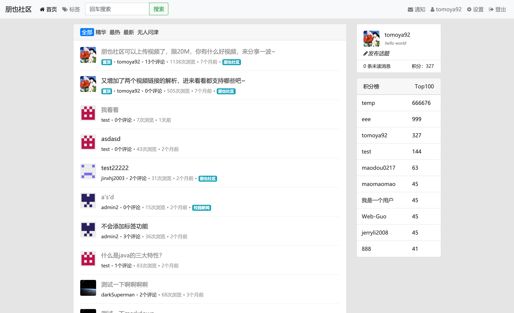

> 使用说明：请在醒目的地方标明 powered by pybbs

[English README](README.en_US.md)

当前版本：5.0，后面不折腾了，折腾不动了，就在这个版本上维护了

- 前台地址：[http://localhost:8080/](http://localhost:8080/) 用户名密码自己注册
- 后台地址：[http://localhost:8080/adminlogin](http://localhost:8080/adminlogin) 用户名: test 密码: 123123

如果发现了bug或者有好的建议，欢迎提issue，当然更欢迎 pr

## 捐赠&商用付费

- 个人学习使用永久免费
- 商用授权一次性付费 **￥68.00** 永久使用


[捐赠列表](https://github.com/tomoya92/pybbs/wiki/%E6%8D%90%E8%B5%A0)

## 文档

[文档地址](https://tomoya92.github.io/pybbs/)

文档地址打不开看这里（需要电脑上配置好maven环境）

下载项目，进入到docs文件夹里，然后运行 `mvn clean compile` 运行完成后，在 `docs/target/generated-docs` 里会生成一堆的html文件，用浏览器打开 `index.html` 即可查看

## 技术栈

- Spring-Boot
- Shiro
- MyBatis-Plus
- Bootstrap
- MySQL
- Freemarker
- Redis
- ElasticSearch
- WebSocket
- I18N

## 特色

没啥特色，跟3.0相比，也就在后台里加了个系统设置的配置 [各版本之间对比](#其它版本) ，可以配置一些3.0版本在 application.yml 里配置的东西，后面还会有增加

## 运行

还是看文档吧，更详细 [传送门](https://tomoya92.github.io/pybbs/#%E5%BF%AB%E9%80%9F%E5%BC%80%E5%A7%8B)

## 手动打包

```bash
mvn clean package
```

打包完成后，会在项目根目录下的target目录里生成一个`pybbs.jar`文件，解压运行 `java -jar pybbs.jar` 即可启动论坛服务

其实手动打包后生成的tar.gz文件就是github上release里最新的发布包，下载后解压内容是一样的

## 测试

项目测试用例还没有写

## 反馈

- [issues](https://github.com/tomoya92/pybbs/issues)
- QQ群 1048094312

*提问题的时候请将问题重现步骤描述清楚*

## 贡献

- 感谢 [@zzzzbw](https://github.com/zzzzbw) 大佬帮忙开发的 `Dockerfile` 和 `docker-compose.yml`
- 感谢 [@sunkaifei](https://github.com/sunkaifei) 提供的阿里云短信验证码登录要用到的 `key` `secret`
- 感谢 [@gdhua](https://github.com/gdhua) 提供的微信联合登录要用到的 `appid` `appsecret`

欢迎大家提 issues 及 pr

## 其它版本

|              | 2.2                                                                 | 2.3                                                     | 2.4                                                                                                                              | 2.6                                                   | 2.6.1 | 3.0                                                                 | 4.0(这个版本是纯接口的)                                                      | master                                      |
| :----------- | :------------------------------------------------------------------ | :------------------------------------------------------ | :------------------------------------------------------------------------------------------------------------------------------- | :---------------------------------------------------- | :---- | :------------------------------------------------------------------ | :--------------------------------------------------------------------------- | :------------------------------------------ |
| 开源地址     | [传送门](https://github.com/tomoya92/pybbs/tree/v2.2)               | [传送门](https://github.com/tomoya92/pybbs/tree/v2.3)   | [传送门](https://github.com/tomoya92/pybbs/tree/v2.4)                                                                            | [传送门](https://github.com/tomoya92/pybbs/tree/v2.6) |       | [传送门](https://github.com/tomoya92/pybbs/tree/v3.0)                | [传送门](https://github.com/tomoya92/pybbs/tree/v4.0-mongodb-api)            | [传送门](https://github.com/tomoya92/pybbs) |
| 开发框架     | JFinal                                                              | JFinal                                                  | Spring-Boot                                                                                                                      | Spring-Boot                                           |       | Spring-Boot，MyBatis                                                | Spring-Boot                                                                  | Spring-Boot, Mybatis-Plus                   |
| 数据库       | MySQL                                                               | MySQL                                                   | MySQL                                                                                                                            | MySQL                                                 |       | MySQL                                                               | MongoDB                                                                      | MySQL                                       |
| 前台         | &radic;                                                             |                                                         |                                                                                                                                  |                                                       |       | &radic;                                                             |                                                                              | &radic;                                     |
| 后台         | &radic;                                                             |                                                         |                                                                                                                                  |                                                       |       | &radic;                                                             |                                                                              | &radic;                                     |
| 前后台合一   |                                                                     | &radic;                                                 | &radic;                                                                                                                          | &radic;                                               |       |                                                                     |                                                                              |
| 编辑器       | [WangEditor(富文本)](https://github.com/wangfupeng1988/wangEditor/) | [editor(Markdown)](https://github.com/lepture/editor)   | 可切换 [editor(Markdown)](https://github.com/lepture/editor) [WangEditor(富文本)](https://github.com/wangfupeng1988/wangEditor/) | [pyeditor](https://github.com/tomoya92/pyeditor)      |       | [WangEditor(富文本)](https://github.com/wangfupeng1988/wangEditor/) |                                                                              | [CodeMirror](https://codemirror.net/)       |
| 积分机制     | &radic;                                                             | &radic;                                                 |                                                                                                                                  | &radic;                                               |       | &radic;(这个版本叫声望)                                             | &radic;                                                                      | &radic;                                     |
| 私信         | &radic;                                                             |                                                         |                                                                                                                                  |                                                       |       |                                                                     |                                                                              |
| 本地登录注册 | &radic;                                                             |                                                         | &radic;                                                                                                                          | &radic;                                               |       | &radic;                                                             | &radic;                                                                      | &radic;                                     |
| Github登录   |                                                                     | &radic;                                                 |                                                                                                                                  |                                                       |       | &radic;                                                             |                                                                              ||
| QQ登录       | &radic;                                                             |                                                         |                                                                                                                                  |                                                       |       |                                                                     |                                                                              ||
| 微博登录     | &radic;                                                             |                                                         |                                                                                                                                  |                                                       |       |                                                                     |                                                                              ||
| 网站接口     | &radic;                                                             | &radic;                                                 | &radic;                                                                                                                          | &radic;                                               |       | &radic;                                                             | &radic;                                                                      ||
| 权限         | RBAC                                                                | RBAC                                                    | RBAC                                                                                                                             | RBAC                                                  |       | RBAC                                                                | 通过配置用户名增加一些额外功能                                               | RBAC                                        |
| 搜索         | 模糊搜索                                                            | Solr                                                    | 模糊搜索                                                                                                                         | Hibernate-Search                                      |       | Elasticsearch                                                       |                                                                              ||Elasticsearch                               |
| 标签         | &radic;                                                             | &radic;                                                 |                                                                                                                                  | &radic;                                               |       | &radic;                                                             |                                                                              | &radic;                                     |
| 国际化       |                                                                     |                                                         | &radic;                                                                                                                          |                                                       |       |                                                                     |                                                                              ||
| APP          |                                                                     | [pybbsMD(Android)](https://github.com/tomoya92/pybbsMD) |                                                                                                                                  |                                                       |       |                                                                     |                                                                              ||
| 前端         |                                                                     |                                                         |                                                                                                                                  |                                                       |       |                                                                     | [pybbs-front-react(React.js)](https://github.com/tomoya92/pybbs-front-react) ||

## License

GNU AGPLv3 (pybbs4.0开始，开源协议从MIT更改为GNU AGPLv3)

---

**简洁的首页列表**



**帖子详情页**


**支持这么多网站的视频链接解析**


