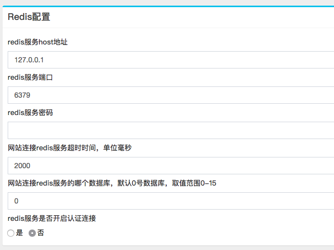

The program also has built-in redis for caching.

Configure Address: Launcher -> Login Backend -> 系统设置

According to your environment configuration redis information, save it can be used, no need to restart! !

