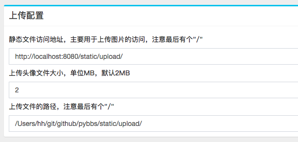

After the program is started, you need to configure the path to save the uploaded file, otherwise the user will not see your avatar after registration.

Configure Address: Launcher -> Login Backend -> 系统设置



Description:

**The path must be an absolute path**

### Non-nginx static mapping configuration

If you are not using nginx for static file mapping, please configure it in the program startup directory, for example:

The jar package you downloaded is stored in `/opt/pybbs/pybbs.jar` then the address here should be `/opt/pybbs/static/upload/`

If you are using the server deployed by docker, then the path configuration is fixed `/app/static`, 
and the uploaded image will be automatically synced to the static folder in the docker startup directory.

### Nginx static file mapping configuration method

Nginx static file mapping configuration

```
server {
  #...
  location /static/ {
    root /opt/cdn/;
    autoindex on;
  }
}
```

Then your configuration on the ground should be `/opt/cdn/static/upload/`

### Address

The default is `http://localhost:8080/static/upload/`. If your access domain name is `http://example.com`, then change it to `http://example.com/static/upload/`
