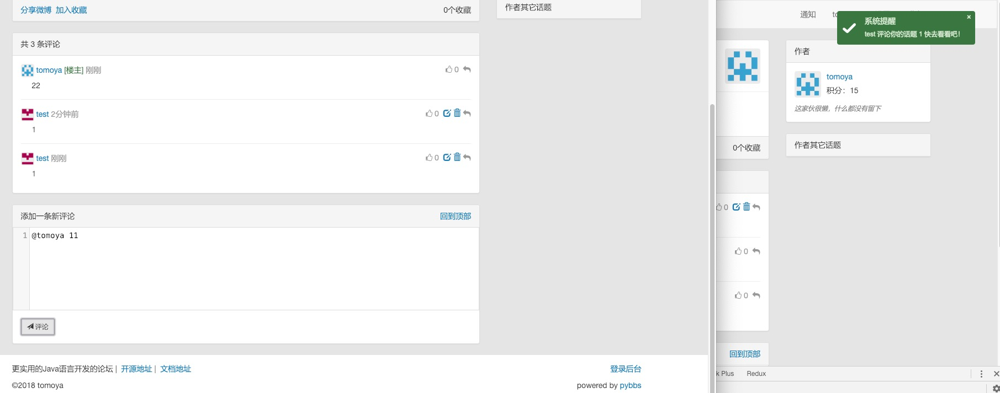
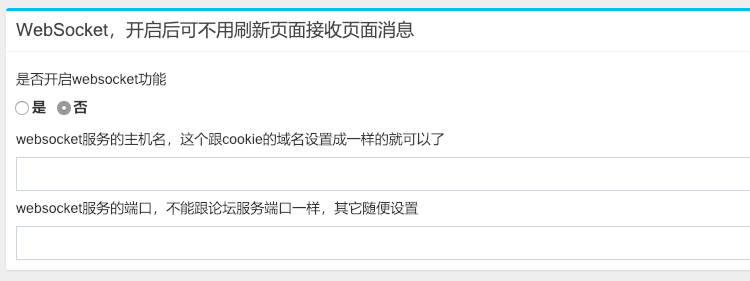

The websocket function is turned off by default. Why is it not enabled by default? 
Because this product is used in the forum, the reasons are as follows

1. Start a forum and start a websocket service.
2. When the forum service is closed, the websocket service will stay for a while, saying that it is not too short or short, 
    and it takes about 1-2 minutes before and after.
3. The forum does not have the function of getting data without refreshing the page (such as pjax), 
    so every time you visit the page in the forum, the page will be refreshed, which will cause the ws connection to be disconnected, 
    and then wait for the page to load, it will start to reconnect.

The functions currently developed around ws are as follows

- Your topic is collected and you will be notified
- Your topic is commented and will be notified
- Your comments are replied and you will be notified
- After entering the page, ws will automatically get the number of unread messages and then display 
    them on Header and `document.title` on the page.

as follows

Of course, opening the websocket service is not without benefits, such as:

- In the above picture, someone will reply to their comments and will receive a message immediately.
- Send a post waiting for someone to reply, don't have to refresh the page all the time to see if there is any new news.

Follow-up ideas:

- Give the forum access to pjax, let the webpage implement no refresh content, so the ws connection will not be broken.
- Develop a set of ws theme for the forum. There is only one homepage for the whole station. 
    The content is all pushed to the front end from the server through the ws service. 
    This sounds very good, and the implementation is not very good. It is equivalent to re-developing a website.

-----

If you read the above instructions, still want to open, the configuration is as follows

Only three configurations

1. Turn on the function
2. The host name of the ws service, this is the forum that I used to access the `http://localhost:8080` during development, 
    so it is configured as `localhost` here.
3. The port of the ws service, the port of the forum is 8080. When I was developing, it was configured as 8081, 
    as long as it does not conflict with the ports of other services.

**As for the host name above can be configured as other, I have not tried, but since it is a set of services,
    it should be able to be configured as a separate domain name, and should also be able to directly extract into a separate service, 
    this I have not verified, interested friends can try**
    
Then start the system directly, note that the ws service is only valid for users who log in at the frontend.

**There is another point to explain, if you open the ws service during the development process, 
    when you change the code, you need to restart it. Wait for 1-2 minutes in the middle. 
    I don't know if the service is not the same as the forum service. Stop, if you have a solution, please let me know**