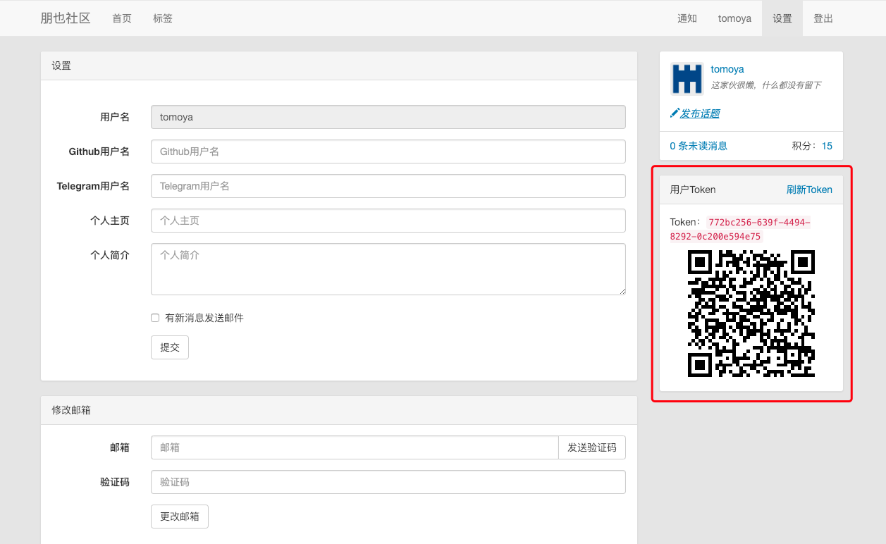

**系统默认开启了cors访问，任何源都可以访问 `/api/**` 下的资源，如果想关闭的话，可以通过修改源码的方式关闭，源码位置 `co.yiiu.pybbs.config.WebMvcConfig`**

有的接口请求要求带上用户的`token`参数，这个token是在用户注册的时候自动生成的，可以在个人设置页面重新生成

token的获取方式：

用户登录上论坛，打开页面最上方的 设置，在页面右边可以查看到自己的token，如下图

