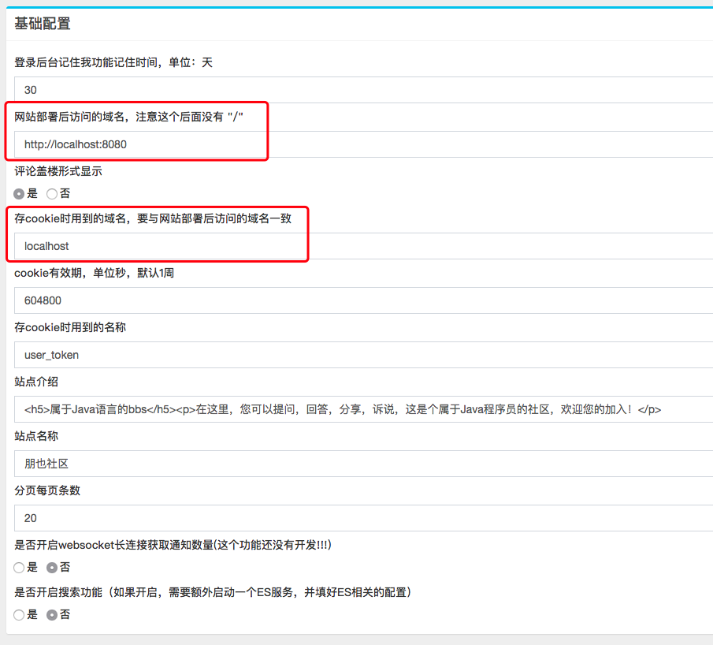

网站基本配置

这版的配置相对其它版本的配置要简单的多，唯一要配置的就是数据库相关的配置了(如果你的数据库用户名是root 密码是空的，数据库又是跟程序在一个机器上，那就不需要配置)

配置数据库连接找到配置文件修改如下配置

- `src/main/resources/application-dev.yml` 开发启动时的配置文件
- `src/main/resources/application-prod.yml` 部署时的配置文件
- `src/main/resources/application-docker.yml` 通过docker启动时的配置文件

```yml
datasource_driver: com.mysql.cj.jdbc.Driver
datasource_url: jdbc:mysql://localhost:3306/pybbs?useSSL=false&characterEncoding=utf8
datasource_username: root
datasource_password:
```

关于其它的配置，启动程序 -> 访问后台 -> 系统设置  如图


有几个地方是必须要修改的，如下图中红框中的配置



说明：

1. 网站的访问域名如果为 `http://example.com` 那么 `网站部署后访问的域名，注意这个后面没有 "/"` 这个说明下的内容就应该替换成 `http://example.com`
2. 第一步配置好域名后，cookie 的域名设置也要做相应的修改，否则用户登录的记录没法保存下来，在 `存cookie时用到的域名，要与网站部署后访问的域名一致` 这个说明下将 `localhost` 替换成 `example.com` 即可
3. 除了上面两条必须要修改外，网站的上传路径也要提前做好配置，具体参见 [上传配置](zh-cn/upload)

其它的配置根据自己环境做相应的修改即可
